# Network-on-Chip (`spinalextras.lib.noc`)

A configurable, topology-agnostic on-chip packet network with virtual-channel
flow control and wormhole routing. A `NoC` instance is a `Stream`-based fabric
of `RouterNode`s wired together according to a pluggable `Topology`
(Mesh, Torus, Ring, Tree, or Star); producers/consumers attach at any node's
local port and address each other by node number.

This document describes the architecture as implemented in
[`lib/noc/`](.) and its `topology`/`virtualchannels` sub-packages. Class and
field names below are verbatim from the source.

## Contents

- [Top-level component](#top-level-component)
- [Configuration](#configuration)
- [Addressing &amp; topologies](#addressing--topologies)
- [Flit and packet format](#flit-and-packet-format)
- [Router node internals](#router-node-internals)
- [Virtual-channel allocation](#virtual-channel-allocation)
- [Wormhole routing across hops](#wormhole-routing-across-hops)
- [Component relationships](#component-relationships)
- [Building a NoC](#building-a-noc)

---

## Top-level component

`NoC(cfg: NocConfig)` exposes one flit-level `Stream` port pair per node and
builds the entire interconnect internally via `cfg.topology.createNodes(this)`.
Port 0 of every node ("LOCAL") is always the one wired to the NoC's external
boundary; every other port connects to a neighbor per the topology's routing
tables.

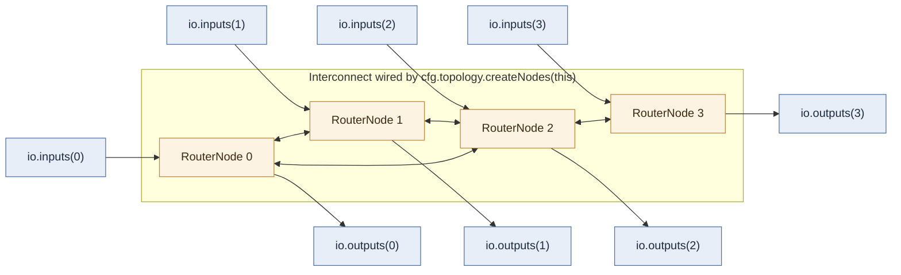

Two construction paths sit on top of `NoC`:

- **`NoC.apply(processors: Seq[NocProcessor], cfg)`** — resizes
  `cfg.topology` to `processors.size` and connects each `NocProcessor` to one
  node's `io.inputs(idx)` / `io.outputs(idx)`.
- **`NoCDesign`** — a builder: `addInput` / `addBitsInput` /
  `addOutput` / `addBitsOutput` accumulate endpoints, `.create()` sizes the
  topology and assembles the `NoC` (see [Building a NoC](#building-a-noc)).

`configureInputNode` / `configureOutputNode` handle packetizing raw
`Stream(Fragment(Bits))` traffic into flits and back — either directly, or via
a register-mapped CSR (`exit_node` register: `destination` + `vcid` fields)
for firmware-driven routing.

## Configuration

All behavior is parameterized by a single `NocConfig`:

| Field | Default | Meaning |
|---|---|---|
| `topology` | `new Mesh()` | Topology object — determines node count, per-node port count, addressing, and routing function |
| `dataWidth` | 32 | Bits per flit's `datum` field |
| `virtualChannels` | 2 | VC lanes multiplexed onto each physical link |
| `vcDepth` | 2 | Depth (in flits) of each per-VC input FIFO |
| `virtualChannelMode` | `Static` | `Static` (dest VC = source VC) or `Dynamic` (VC reassigned to any free lane) |
| `virtualChannelArbitrationPolicy` | `RoundRobin` | `RoundRobin` or `LowestFirst` — candidate arbitration inside `GrantTable` |

Derived: `headerApplicationBits = dataWidth − topology.addressSize`,
`virtualChannelBits = log2Up(virtualChannels)`.

## Addressing &amp; topologies

Every `Topology` provides `nodes`, `addressSize`, a routing function
`resolveDestPort(dest, curr)`, and `resolveNeighborAddress(address, port)` used
once at elaboration time to wire every link. Per-node port *count* varies with
position — a mesh corner has fewer ports than an interior node — via
`nodePortIndicesForCanonicalPorts(address)`.

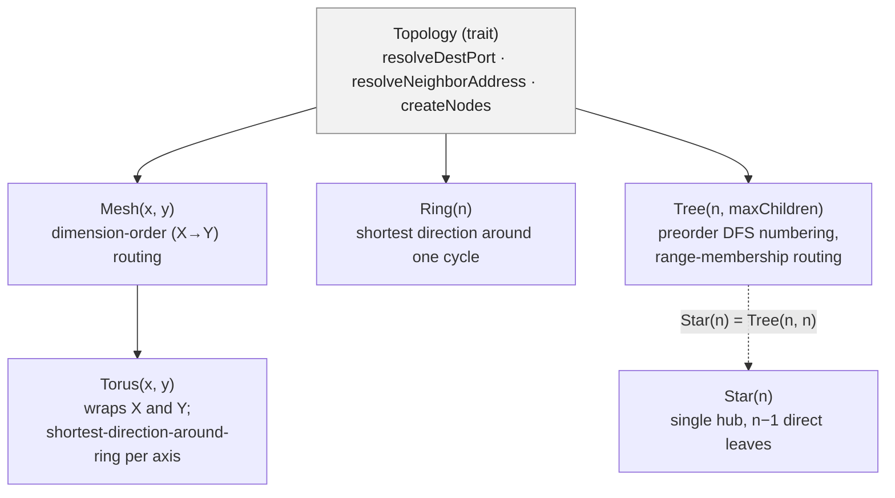

### Mesh — dimension-order (X-then-Y) routing

`Mesh(3, 2)`: address = `x * gridSize._2 + y`. `resolveDestPort` compares `x`
first (WEST/EAST), then `y` (NORTH/SOUTH); corner and edge nodes simply omit
the ports they don't need.

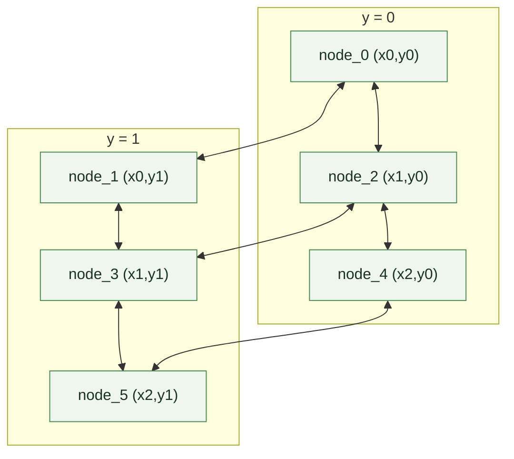

### Torus — mesh with wraparound, ring routing per axis

Same grid as Mesh, but `createAddress` wraps modulo the grid size and every
node keeps all 5 ports (no edges). `resolveDestPort` calls the shared
`Ring.apply(delta, curr, size)` primitive independently per axis, picking
whichever direction is shorter around that axis's wraparound.

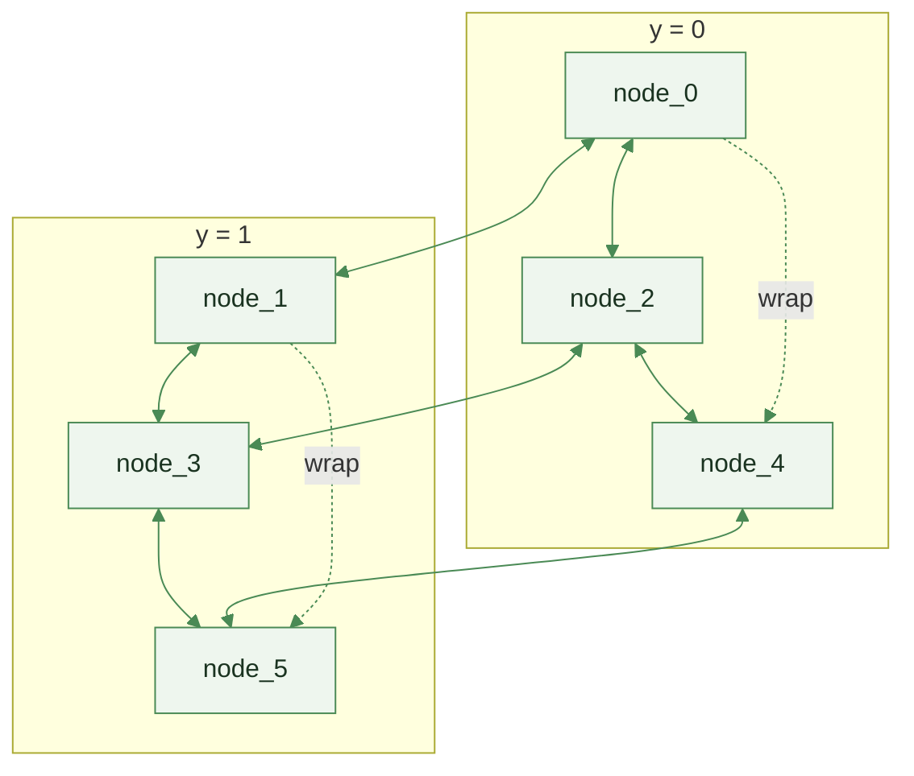

*(illustrative — the wrap edges shown are the extra links a torus adds over
the equivalent mesh; `Torus(3,2)`'s Y-wrap is degenerate since Y only has 2
rows)*

### Ring — shortest direction around one cycle

`Ring(6)`: every node has exactly 3 ports — LOCAL, `ClockWise`,
`CounterClockWise`. `Ring.apply` compares `dest − curr` against `size/2` to
pick the shorter direction; this primitive is reused per-axis by `Torus`.

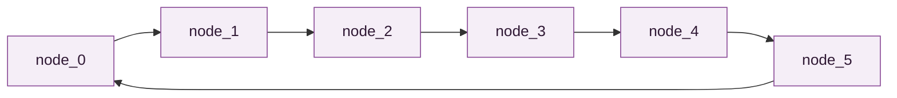

### Tree / Star — preorder DFS addressing, range-membership routing

`Tree(totalNodes, maxChildren)` numbers nodes by preorder DFS, so each
subtree occupies a contiguous `[lo, hi]` address range and `resolveDestPort`
is a constant range compare per child (no divide/mod in hardware). Ports:
`LOCAL = 0`, `UP = 1` (absent at the root), `DOWN(i) = 2 + i` (one per actual
child). `Star(n)` is simply `Tree(n, n)` — a single hub whose "maxChildren"
covers every remaining node, so it collapses to one level.

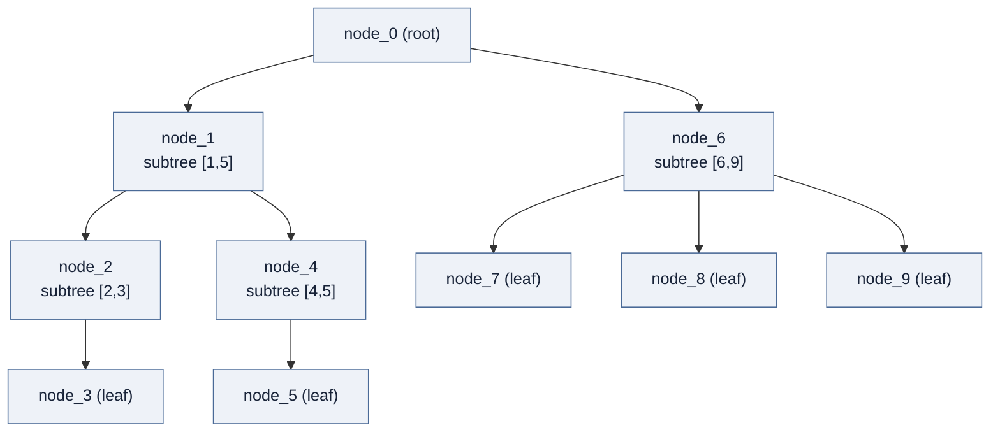

*(illustrative partitioning for `Tree(10, 2)` — actual subtree sizes are
computed by `buildSubtree`, which splits remaining nodes evenly across
children, earlier children absorbing any remainder)*

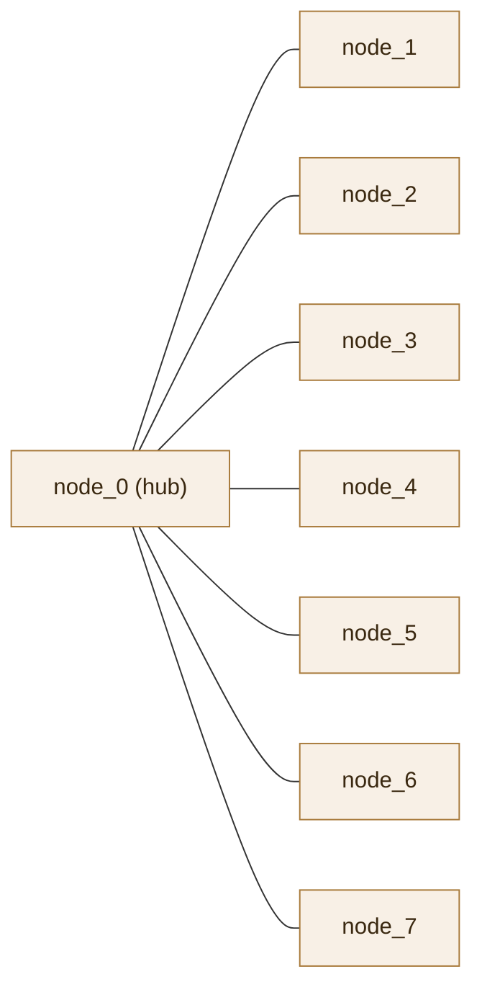

`Star(8) = Tree(8, 8)` — every leaf is a direct child of the hub.

On the wire, `Header.dest` carries `topology.addressSize` bits. For most
topologies this is the linear node index directly; **Mesh and Torus instead
pack `x` into the low bits and `y` into the high bits**
(`addressToRouteableAddress` / `routeableAddressToAddress`), so the on-wire
address differs from the Scala-side linear index used for wiring.

## Flit and packet format

The physical-link unit is a `Flit`, wrapped in `Fragment[Flit]` (adds a
`last` bit) traveling over a `Stream`. A **packet** is one or more
consecutive flits on the same `(port, vc)` up to `last`. The first flit's
`datum` is always a bit-packed `Header`, sized to exactly fill `dataWidth`
bits (`headerApplicationBits = dataWidth − addressSize`).

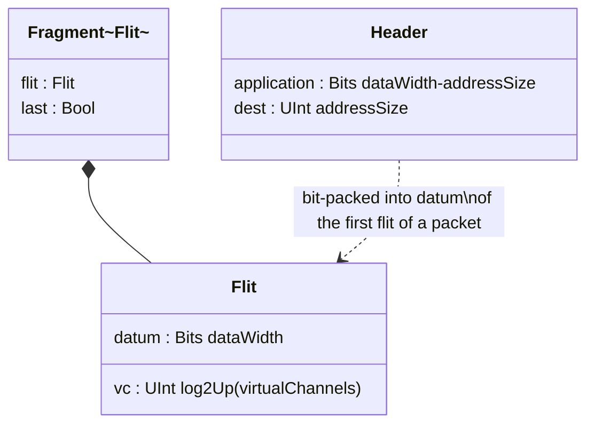

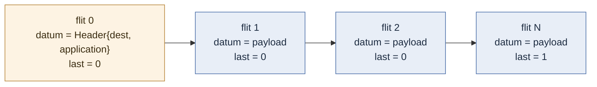

Internally, once a packet's output port has been resolved, `RouterNode`
tags subsequent flits with a `RoutedFlit { flit: Flit, routedNode: UInt }`
so the destination port doesn't need to be recomputed per flit.

## Router node internals

`RouterNode(cfg, address)` has `connectivityIn = connectivityOut =`
the number of canonical ports this node actually has. Each physical input
port owns one `StreamFifo` per VC (`InputPort`, depth `cfg.vcDepth`) — this
is the actual flow-control boundary (ordinary `Stream` ready/valid
backpressure, not an explicit credit protocol). A header-decode stage per
`(input port, vc)` resolves the destination port once per packet and hands
off to a shared `VirtualIdAllocator`, which arbitrates all contending
packets for output ports and destination VC lanes. Each physical output
port then merges its VC lanes with a priority arbiter (`OutputPort`).

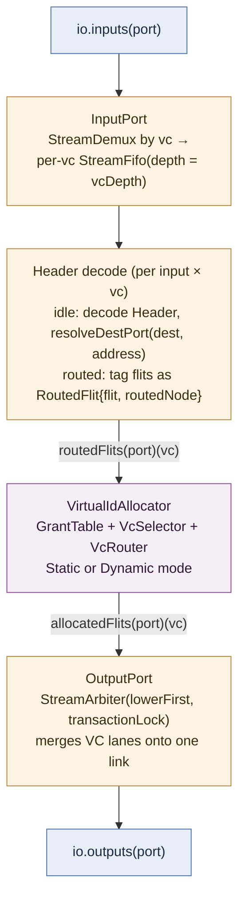

## Virtual-channel allocation

`VirtualIdAllocator` picks the mechanism per `cfg.virtualChannelMode`:

- **Static** — a packet's destination VC lane always equals its source VC
  id. Per `(output port, vc)`, a `GrantTable(connectivityIn, 1)` arbitrates
  only among the input ports contending for that one fixed lane.
- **Dynamic** — any `(input port, source vc)` may be granted *any* free
  destination VC lane on an output. Per output port, one
  `GrantTable(connectivityIn × virtualChannels, virtualChannels)` arbitrates
  the full candidate set; `retag` rewrites the winning flit's `vc` field.

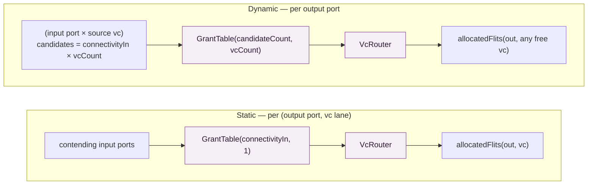

Inside `GrantTable`, a `candidateSelector` (`VcSelector`, policy =
`RoundRobin` or `LowestFirst`) picks a requester and a `laneSelector`
(always plain priority — lanes are interchangeable) picks a free lane;
when both agree, the grant is latched and held until the granted stream's
`last` fires (`io.release`), which is what makes this **wormhole routing**:
once granted, a packet's whole path is locked and later flits skip
re-arbitration.

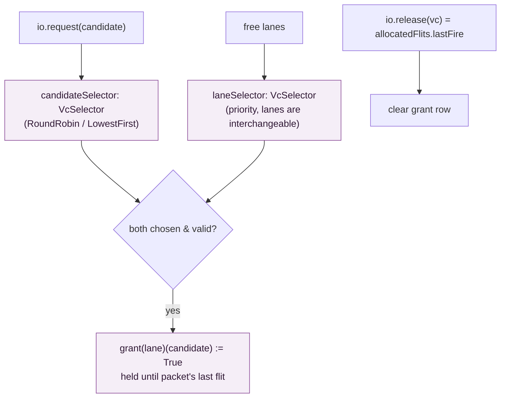

At the physical output link, `OutputPort` merges the granted VC lanes with
`StreamArbiterFactory().lowerFirst.transactionLock` — lower-VC-id priority,
whole-packet locking, so flits from different packets never interleave on
the wire even though several VCs share one physical link.

## Wormhole routing across hops

```mermaid
sequenceDiagram
  participant Src as Source (external, node A)
  participant A as RouterNode A
  participant B as RouterNode B
  participant C as RouterNode C (dest)

  Src->>A: header flit (dest=C, vc=v), last=0
  A->>A: decode header · resolveDestPort → toward B
  A->>A: allocator grants (in←A, out→B, vc')
  A->>B: header flit forwarded
  B->>B: decode header · resolveDestPort → toward C
  B->>B: allocator grants (in←A-side, out→C, vc'')
  B->>C: header flit forwarded
  Note over A,C: latched vc register at each hop —<br/>later flits reuse the same granted path,<br/>no re-arbitration (wormhole)
  Src->>A: payload flit 1
  A->>B: payload flit 1
  B->>C: payload flit 1
  Src->>A: payload flit N, last=1
  A->>B: payload flit N, last=1
  B->>C: payload flit N, last=1
  Note over A,B,C: last=1 fires GrantTable.release at every hop —<br/>path torn down, lanes free for the next packet
```

Because each VC lane is buffered and arbitrated independently, one packet
stalled on a shared physical link does not head-of-line-block a different
packet occupying another VC — verified directly by the `manyToOne` /
`floodPackets` scenarios in `lib/tests/NoCConcurrence.scala`.

## Component relationships

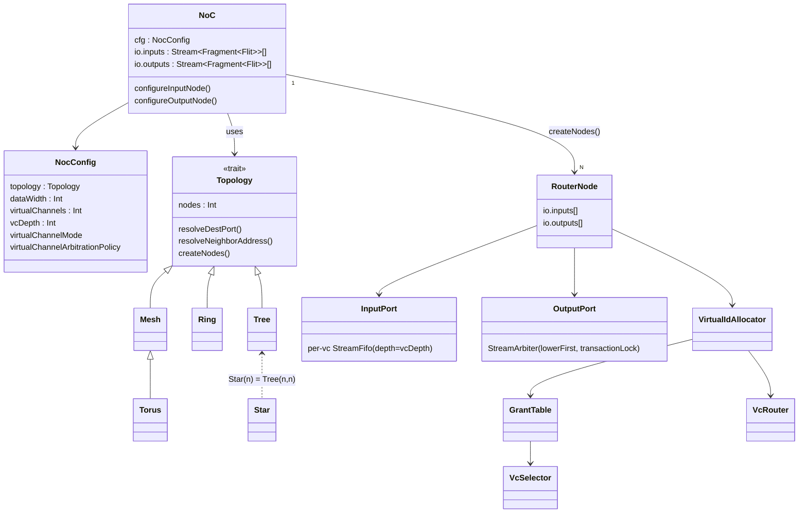

## Building a NoC

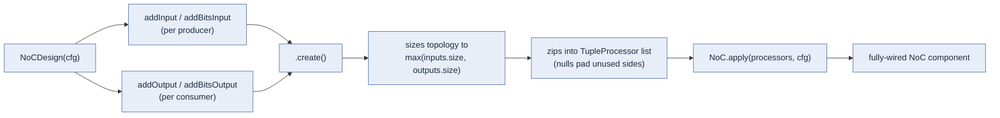

For manually-built endpoints, `NoC.apply(processors: Seq[NocProcessor], cfg)`
skips the builder and connects a pre-existing list of
`Stream[Fragment[Flit]]` pairs directly.

### Test harnesses

- `lib/tests/NoCPathing.scala` — single-packet delivery correctness across
  every entry in `NocConfig.testConfigurations()` (all five topologies ×
  VC count × VC mode × arbitration policy).
- `lib/tests/NoCConcurrence.scala` — forks one sender per source node,
  reconstructs packets per `(node, vc)` on receive, and asserts both
  correctness *and* genuine overlap-in-flight (`overlapExists`) — including
  a `manyToOne` scenario that deliberately contends multiple senders on one
  destination's inbound link across distinct VCs to stress VC isolation.
