# Network-on-Chip (`spinalextras.lib.noc`)

A configurable, topology-agnostic on-chip packet network with virtual-channel
flow control and wormhole routing. A `NoC` instance is a `Stream`-based fabric
of `RouterNode`s wired together according to a pluggable `Topology`
(Mesh, Torus, Ring, Tree, or Star); producers/consumers attach at any node's
local port and address each other by node number.

This document describes the architecture as implemented in
[`lib/noc/`](.) and its `topology`/`virtualchannels`/`protocols` sub-packages,
plus the generic arbitration primitives in
[`lib/misc/arbitration/`](../misc/arbitration). Class and field names below
are verbatim from the source.

## Contents

- [Configuration](#configuration)
- [Addressing &amp; topologies](#addressing--topologies)
- [Flit and packet format](#flit-and-packet-format)
- [Router node internals](#router-node-internals)
- [Virtual-channel allocation](#virtual-channel-allocation)
- [Deadlock avoidance: escape-VC datelines](#deadlock-avoidance-escape-vc-datelines)
- [Wormhole routing across hops](#wormhole-routing-across-hops)
- [Forced-stall points](#forced-stall-points)
- [Protocol adapters](#protocol-adapters)
- [Component relationships](#component-relationships)
- [Building a NoC](#building-a-noc)
- [NoCBuilder usage](#nocbuilder-usage)
- [Gate count / resource usage](#gate-count--resource-usage)
- [Test harnesses](#test-harnesses)

---

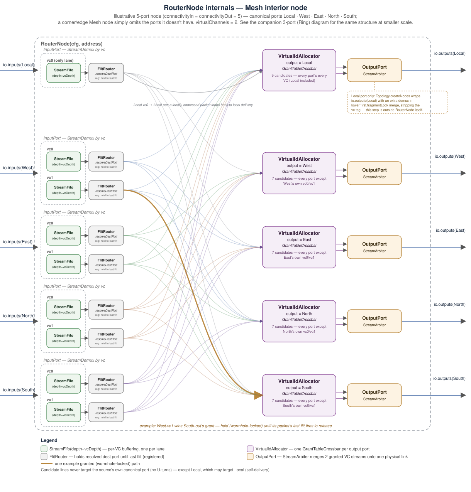

## Configuration

All behavior is parameterized by a single `NocConfig`:

| Field | Default | Meaning |
|---|---|---|
| `topology` | `new Mesh()` | Topology object — determines node count, per-node port count, addressing, and routing function |
| `dataWidth` | 32 | Bits per flit's `datum` field |
| `virtualChannels` | 2 | VC lanes multiplexed onto each physical link |
| `vcDepth` | 2 | Depth (in flits) of each per-VC input FIFO |
| `virtualChannelMode` | `Static` | `Static` (dest VC = source VC, subject to the dateline exception below) or `Dynamic` (VC reassigned to any free lane, same exception) |
| `virtualChannelArbitrationPolicy` | `RoundRobin` | `RoundRobin` or `LowestFirst` — candidate-selection policy inside `GrantTableArbiter` |
| `routingMode` | `Stall` | `Stall` (today's behavior), `Async`, or `Register` — controls how `FlitRouter`'s route decision and `GrantTableCrossbar`'s VC grant expose an already-determined decision to whatever's waiting on it. Same routing/VC/deadlock-avoidance decisions in every mode — only *when*/*how* an already-determined decision takes effect changes. See [Forced-stall points](#forced-stall-points) |

Derived: `headerApplicationBits = dataWidth − topology.addressSize`,
`virtualChannelBits = log2Up(virtualChannels)`, `datatype = Bits(dataWidth
bits)` (the external flit payload type). `NocConfig.packHeader(dest,
subheader)` builds a `Header` with `dest` plus a subheader value packed into
the low bits of `application` — the mechanism the protocol adapters
(below) use to carry a return address alongside the routing destination.

Each `Topology` also declares a `minimumVirtualChannels` (1 for Mesh/Tree/Star,
2 for Ring/Torus — the escape-VC mechanism needs a spare lane; see
[Deadlock avoidance](#deadlock-avoidance-escape-vc-datelines)).
`NocConfig.testConfigurations()` sweeps every topology × `virtualChannels ∈
{1,2,4}` × VC mode × arbitration policy, filtered to combinations that meet
the topology's own minimum.

## Addressing &amp; topologies

Every `Topology` provides `nodes`, `addressSize`, `resolveNeighborAddress`
(used once at elaboration time to wire every link), and two per-topology
override points a subclass actually implements:

- **`resolveCanonicalDestPort(dest, curr, setResult)`** — the routing
  decision, expressed in stable **canonical port** numbers (e.g. Mesh's
  `Local=0, West=1, East=2, North=3, South=4` — fixed regardless of which
  ports a given node happens to have wired up).
- **`allowedTransitionTable(cfg, port, candidateCount, vcCount)`** — the
  VC-transition restriction matrix for one output port (see
  [Virtual-channel allocation](#virtual-channel-allocation) and
  [Deadlock avoidance](#deadlock-avoidance-escape-vc-datelines)). The default
  implementation just switches on `cfg.virtualChannelMode`
  (`GrantTable.diagonal` for Static, `GrantTable.allowAll` for Dynamic); Ring
  and Torus override it.

The public `resolveDestPort(dest, curr, inputPort)` wraps
`resolveCanonicalDestPort` and compacts its result into the *port-index*
space a specific node/input actually has — importantly, **excluding
`inputPort`'s own canonical port** (no U-turns: a flit can never be routed
back out the port it arrived on), **except when `inputPort` is `Local`**
(canonical port 0): `nodePortIndicesForCanonicalPorts`'s self-exclusion is
gated on `inputPort != 0`, so a locally-injected packet may still target
Local as its own destination — i.e. a packet addressed to this node's own
address loops straight back to local delivery instead of having no valid
route at all. Per-node port *count* varies with position — a mesh corner
has fewer ports than an interior node — via
`nodePortIndicesForCanonicalPorts(address)`; the same function with an
`inputPort` argument gives the output-side numbering used by
`resolveDestPort`.

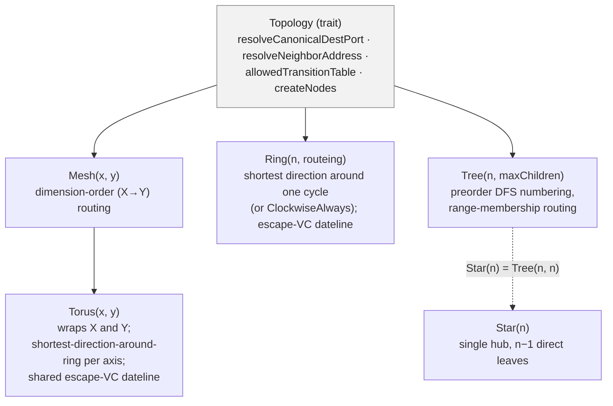

### Mesh — dimension-order (X-then-Y) routing

`Mesh(3, 2)`: address = `x * gridSize._2 + y`. `resolveCanonicalDestPort`
compares `x` first (WEST/EAST), then `y` (NORTH/SOUTH); corner and edge nodes
simply omit the ports they don't need. No physical cycle, so
`minimumVirtualChannels = 1` and no escape-VC handling is needed.

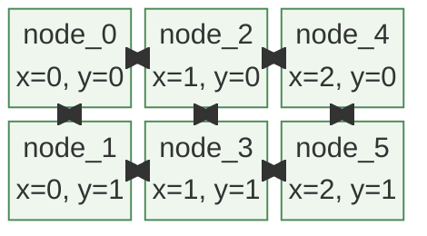

### Torus — mesh with wraparound, ring routing per axis

Same grid as Mesh, but `createAddress` wraps modulo the grid size and every
node keeps all 5 ports (no edges). `resolveCanonicalDestPort` calls the
shared `Ring.apply(delta, curr, size)` primitive independently per axis,
picking whichever direction is shorter around that axis's wraparound. Because
this introduces two physical cycles (an X-ring and a Y-ring),
`minimumVirtualChannels = 2` and `Torus` overrides `allowedTransitionTable`
with a single shared escape VC covering both axes — see
[Deadlock avoidance](#deadlock-avoidance-escape-vc-datelines).

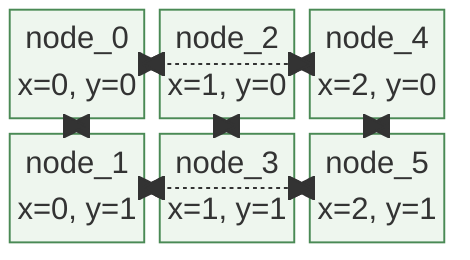

*(illustrative — the wrap edges shown are the extra links a torus adds over
the equivalent mesh; `Torus(3,2)`'s Y-wrap is degenerate since Y only has 2
rows)*

### Ring — shortest direction around one cycle

`Ring(size, routeing)`: every node has exactly 3 canonical ports — `Local`,
`ClockWise`, `CounterClockWise`. With the default `routeing = Closest`,
`Ring.apply` compares `dest − curr` against `size/2` to pick the shorter
direction; this primitive is reused per-axis by `Torus`. The alternate
`routeing = ClockwiseAlways` routes every non-local packet clockwise only,
regardless of distance — used by a concurrency regression test (see
[Test harnesses](#test-harnesses)) to isolate a starvation bug that had
nothing to do with direction-vs-direction contention.
`minimumVirtualChannels = 2`: a ring is one physical cycle, so `Ring`
overrides `allowedTransitionTable` with an escape-VC dateline at the one
wraparound edge.

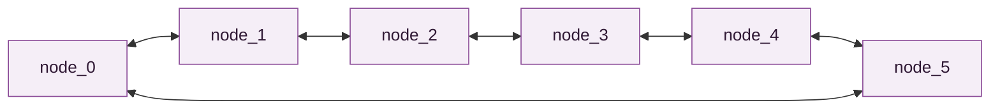

### Tree / Star — preorder DFS addressing, range-membership routing

`Tree(totalNodes, maxChildren)` numbers nodes by preorder DFS, so each
subtree occupies a contiguous `[lo, hi]` address range and
`resolveCanonicalDestPort` is a constant range compare per child (no
divide/mod in hardware). Ports: `LOCAL = 0`, `UP = 1` (absent at the root),
`DOWN(i) = 2 + i` (one per actual child). `Star(n)` is simply `Tree(n, n)` —
a single hub whose "maxChildren" covers every remaining node, so it collapses
to one level. A tree has no cycles, so `minimumVirtualChannels = 1` and no
escape-VC handling applies here either.

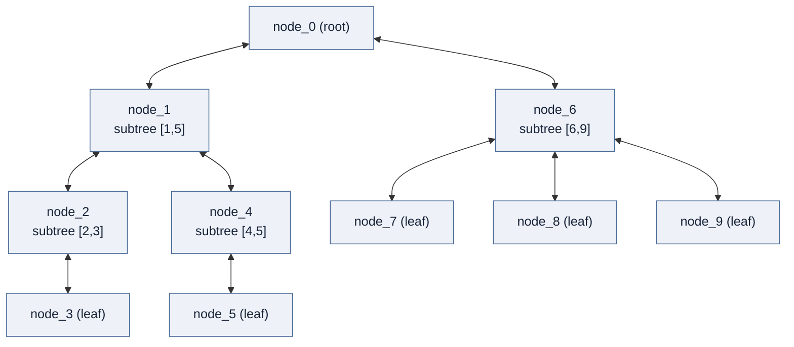

*(illustrative partitioning for `Tree(10, 2)` — actual subtree sizes are
computed by `buildSubtree`, which splits remaining nodes evenly across
children, earlier children absorbing any remainder)*

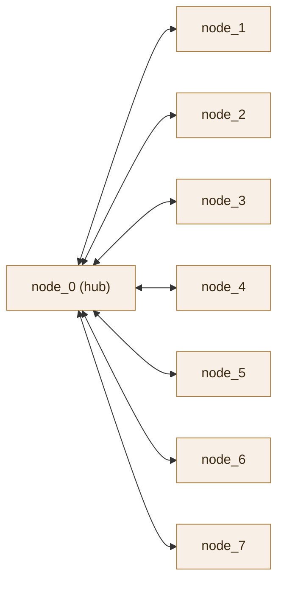

`Star(8) = Tree(8, 8)` — every leaf is a direct child of the hub.

On the wire, `Header.dest` carries `topology.addressSize` bits. For most
topologies this is the linear node index directly; **Mesh and Torus instead
pack `x` into the low bits and `y` into the high bits**
(`addressToRouteableAddress` / `routeableAddressToAddress`), so the on-wire
address differs from the Scala-side linear index used for wiring.

## Flit and packet format

The physical-link unit is a `Flit`, wrapped in `Fragment[Flit]` (adds a
`last` bit) traveling over a `Stream`. A **packet** is one or more
consecutive flits on the same `(port, vc)` up to `last`. The first flit's
`datum` is always a bit-packed `Header`, sized to exactly fill `dataWidth`
bits (`headerApplicationBits = dataWidth − addressSize`).

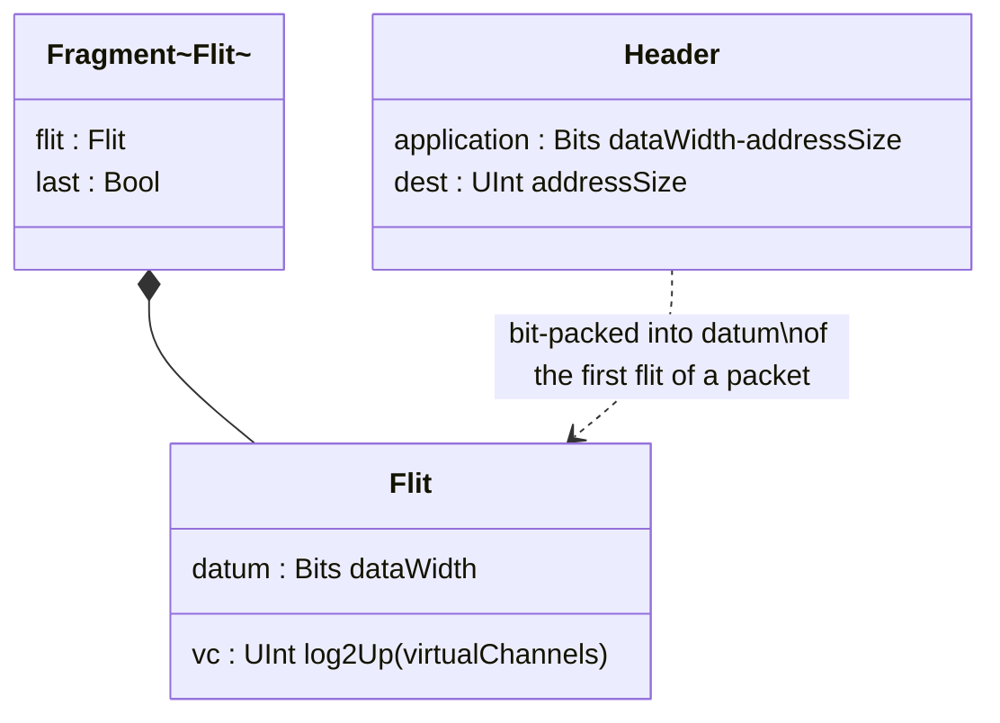

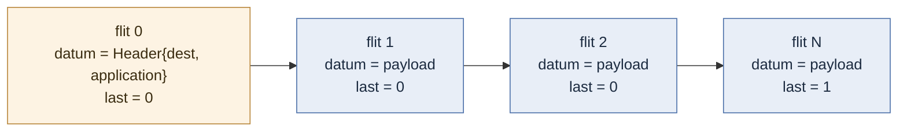

`Flit` mixes in `FormalData`: its `formalIsStateValid()` asserts `vc <
virtualChannels` whenever `virtualChannels` isn't a power of 2 (so the extra
encoding space above the count can't be asserted/assumed as reachable in
formal properties elsewhere).

Internally, `FlitRouter` resolves a packet's destination *canonical* port
once, then demuxes every subsequent flit of that packet straight into the
correspondingly-indexed slot of its own `connectivityOut`-sized output
vector — the destination is the vector index itself, so no separate
`routedNode` tag needs to ride along with the flit downstream.

## Router node internals

`RouterNode(cfg, address)` has `connectivityIn = connectivityOut =`
the number of canonical ports this node actually has. Each physical input
port owns one `StreamFifo` per VC (`InputPort`, depth `cfg.vcDepth`) — this
is the actual flow-control boundary (ordinary `Stream` ready/valid
backpressure, not an explicit credit protocol); the **local (injection)
port always gets exactly one VC lane** regardless of `cfg.virtualChannels`,
since traffic entering the fabric hasn't been assigned a real VC class yet.
A `FlitRouter` per `(input port, vc)` resolves the destination port once per
packet and hands off to a `VirtualIdAllocator` — **one instance per
`(router, output port)`**, not one shared instance per router — which
arbitrates all contending packets for that one output port's destination VC
lanes. Each physical output port then merges its VC lanes back down to one
physical link (`OutputPort`).

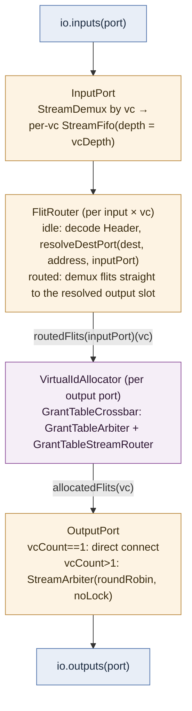

`OutputPort`'s link-merge arbiter deliberately uses `roundRobin.noLock`
rather than the packet-atomic `lowerFirst`/`transactionLock` policy used
elsewhere in the fabric: `noLock` re-arbitrates every single beat instead of
holding a lane for a whole packet — safe here because each flit already
carries its own `vc` tag and gets re-demuxed by the downstream `InputPort`,
so interleaving beats from different VCs on the wire causes no confusion.
That per-beat fairness is what stops a continuously-ready "pool" VC from
starving a bursty escape VC of physical link bandwidth (see
[Deadlock avoidance](#deadlock-avoidance-escape-vc-datelines)). The one
exception is the NoC's own external boundary, wired by
`Topology.createNodes`: the merge from a node's local-port VC lanes out to
`io.outputs(x)` still uses `lowerFirst.fragmentLock`, since flits leaving the
NoC entirely no longer carry a `vc` tag downstream and so must not
interleave packets on that final link.

Each `RouterNode` input also feeds a `GlobalLogger` flow trace
(`noc-router`, `router-input-<address>`, `router-input-<port>-<vc>` tags) of
every packet's first flit — a simulation/debug hook, not part of the routing
logic itself.

## Virtual-channel allocation

VC allocation is built on a **generic, NoC-independent N:M crossbar**,
`spinalextras.lib.misc.arbitration.GrantTableCrossbar`, rather than
NoC-specific plumbing. `VirtualIdAllocator` (one per output port) is a thin
wrapper: it derives one `allowed(v)(c)` matrix from
`cfg.topology.allowedTransitionTable(...)` — where `v` ranges over
destination VC lanes and `c` ranges over every `(input port, source vc)`
candidate contending for this output — and hands it to one
`GrantTableCrossbar`.

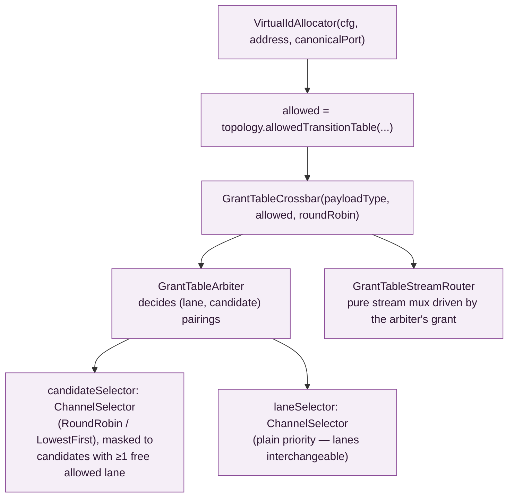

`GrantTable.diagonal(candidateCount, vcCount)` (candidate `c` may only ever
be granted lane `c % vcCount` — Static's dest-VC-pinned-to-source-VC
behavior) and `GrantTable.allowAll(candidateCount, vcCount)` (any candidate,
any lane — Dynamic) are the two generic building blocks `Topology`'s default
`allowedTransitionTable` picks between; `Ring` and `Torus` instead build a
custom `allowed` matrix per call to carve out the escape-VC exception (next
section). Because `GrantTable` only allocates a real `grant` wire for pairs
`allowed(v)(c)` actually marks true, a heavily-restricted matrix (like
Static's diagonal) costs less hardware than an unrestricted one, not more.

Inside `GrantTableArbiter`, `candidateSelector` (a `ChannelSelector`, policy =
`RoundRobin` or `LowestFirst`) picks a requesting candidate — but only among
candidates that currently have at least one free, allowed lane, so it can
never latch onto a candidate that can't presently be served and stall an
otherwise-servable one behind it — and `laneSelector` (always plain priority;
any allowed free lane is as good as any other) picks a lane for it. Both are
"hold until taken" `Stream`-shaped selectors: once a winner is latched, it's
held stable and ignores further changes in `requests` until the consumer
takes it. When both have a valid, mutually-allowed pick, the pairing is
committed into `GrantTable`'s `grant` bits and held until `io.release(v)`
fires — i.e. that lane's occupant's `last` flit fired — which is what makes
this **wormhole routing**: once granted, a packet's whole path is locked and
later flits skip re-arbitration. `GrantTableStreamRouter` is then just a pure
mux driven by the committed `grant` bundle, with formally-stated invariants
(a held pairing can't be silently reassigned except across a release) rather
than any decision logic of its own.

## Deadlock avoidance: escape-VC datelines

Ring and Torus each contain at least one genuine physical cycle. Without
some restriction on how a packet may change VC lanes as it travels, packets
can form a cyclic dependency across those lanes' buffers: once every VC
buffer all the way around the cycle is simultaneously full and each is
waiting on the next, nothing can ever drain — a **permanent** deadlock, not a
transient slowdown a longer timeout would ride out. (This is also why the
concurrency tests deliberately flood far more traffic than the network's
total per-link buffering, `~vcCount * vcDepth` flits — see
[Test harnesses](#test-harnesses) — rather than picking a packet count that
merely happens to work today.)

Both topologies override `Topology.allowedTransitionTable` to reserve the
top VC index (`escapeVc = vcCount - 1`) as a dedicated **escape/dateline**
class, and designate one specific physical edge as the **dateline**:

- **Ring**: the one wraparound edge — `address == size-1` going `ClockWise`,
  or `address == 0` going `CounterClockWise` (the same physical edge, seen
  from each side).
- **Torus**: any of the four wraparound edges (X or Y). Because routing is
  strictly dimension-order (X fully resolves before Y starts), a packet
  needs **at most one** class bump ever, whichever dateline it happens to
  cross first — so **one shared escape class covers both axes**. Giving X
  and Y separate escape classes wouldn't just waste a lane: a packet needing
  both crossings would be forced `escapeX → escapeY` at the Y dateline, a
  class *decrease* that breaks the scheme's monotonic-progress invariant —
  and at `vcCount == 2` it would leave zero pool lanes at all.

The two VC modes differ in how ordinary (non-dateline) hops behave, but both
force the same one-time class bump at the dateline:

- **Dynamic** (Duato's adaptive-escape protocol): ordinary hops are fully
  adaptive among the non-escape "pool" lanes (any candidate, any pool lane).
  Crossing the dateline forces a bump onto the escape lane; once on it, a
  packet stays **sticky** on the escape class for the rest of its trip. The
  escape class alone forms a strict, deterministically-routed sub-network
  with monotonically decreasing "distance to dateline" — the classic
  ingredient that makes an escape-VC scheme provably deadlock-free.
- **Static** (Dally's dimension-order dateline scheme): dest VC is normally
  pinned to source VC for a packet's entire trip — which, left alone, is
  exactly the same cyclic-dependency risk as Dynamic without an escape lane,
  just duplicated per VC class instead of network-wide. The fix mirrors
  Dynamic: pin `destVc = sourceVc` on ordinary hops, but force the one-time
  bump onto the escape class at the dateline.

Both implementations share one subtlety: a candidate's *incoming* `vc` tag
only means "this packet already escaped" if some upstream router's own
`allowedTransitionTable` actually put it there by force. On the `Local`
(injection) port, the incoming tag is just whatever the injecting source
happened to pick — not evidence of a real dateline crossing — so it must
**not** be honored as sticky there; otherwise a packet could inject straight
onto the escape lane and later treat the dateline as an ordinary continuing
hop, reopening the same deadlock. Both `Ring.allowedTransitionTable` and
`Torus.allowedTransitionTable` special-case `inputPort == Local` to prevent
this.

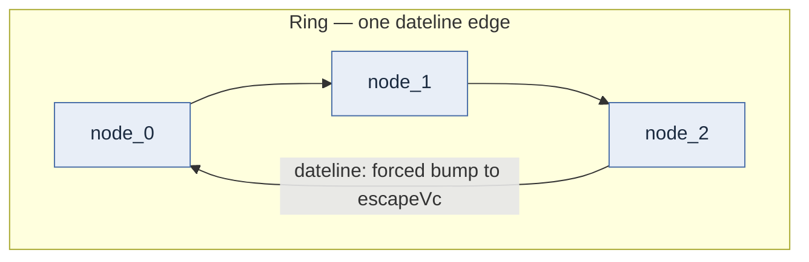

This escape mechanism only exists because `minimumVirtualChannels = 2` for
Ring/Torus — with a single VC there's no spare lane to reserve, so a
one-VC Ring/Torus configuration isn't offered by
`NocConfig.testConfigurations()` at all. (A related, unrelated-to-VC-mode
issue: `vcDepth = 1` doesn't even elaborate on Ring/Torus, since
`spinal.lib.StreamFifo`'s depth-1 case bypasses to a purely combinational
ready path, and chaining that all the way around a physical cycle with no
register anywhere is a genuine RTL combinational loop — see the comment on
`NocConfig.testConfigurations()`.)

`OutputPort`'s `roundRobin.noLock` link-merge policy (see
[Router node internals](#router-node-internals)) is part of the same
deadlock-avoidance story: a fixed regression,
`RingOneWayRegressionSpec` (all traffic forced clockwise-only, so no
direction-vs-direction interaction is even possible), reproduced a deadlock
that traced back to a continuously-ready pool VC starving the escape VC of
physical link bandwidth under the old `lowerFirst`/`transactionLock` policy —
fixed by switching to per-beat round-robin arbitration on the physical link.

## Wormhole routing across hops

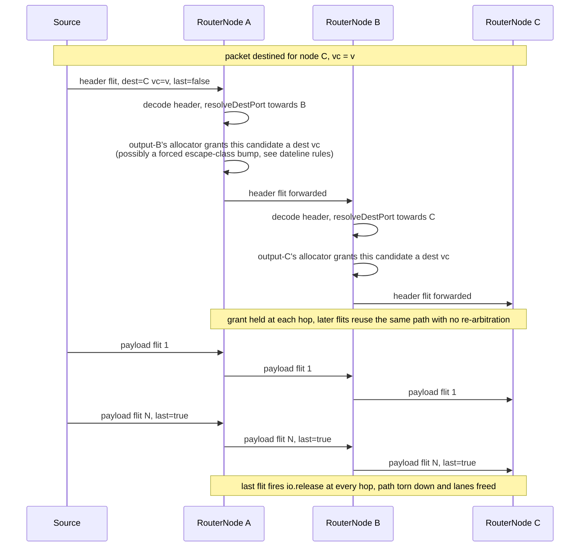

Because each VC lane is buffered and arbitrated independently, one packet
stalled on a shared physical link does not head-of-line-block a different
packet occupying another VC — checked directly by the `manyToOne` /
`floodPackets` scenarios in `lib/tests/noc/NoCConcurrence.scala`.

## Forced-stall points

Independent of congestion, admitting a new packet at a hop goes through a
chain of "latch, then present" registers, each of which unconditionally
costs a cycle even when the outcome is already fully determined the moment
the packet arrives:

1. **`FlitRouter`'s route decision** (`outputNode`) — the destination port
   is a pure function of the header already sitting on `input` this cycle,
   but `outputNode` only exposes it (`outputNode.has_value`) one cycle after
   being set, so a new packet's first flit always pays an unconditional
   1-cycle bubble at every hop before it can move.
2. **`GrantTableArbiter`'s `candidateSelector`/`laneSelector`** (two chained
   `ChannelSelector`s, see [Virtual-channel allocation](#virtual-channel-allocation))
   — each only presents a winner (`io.chosen.valid`) one cycle after it was
   picked, and the picks are sequential (lane selection only starts once
   candidate selection's winner is already presented), so a fresh VC grant
   costs at least two more such cycles even with a single, uncontended
   requester and a completely free lane.
3. On top of that, the crossbar's actual data-path switch
   (`GrantTableStreamRouter`, driven by `grant = io.grant.asReg()`) only
   steers `io.sources(c) <> io.dests(v)` once `grant` itself has been
   *registered* — one more cycle after `candidateSelector`/`laneSelector`
   agree, since the commit in `GrantTableArbiter` happens through `grant`,
   not through the selectors' own combinational outputs.

`routingMode` (see [Configuration](#configuration)) controls all three bubbles
at once, in the two components that actually own a "latch, then present"
register — `FlitRouter` (bubble 1) and `GrantTableCrossbar`/`GrantTableArbiter`
(bubbles 2 and 3 together, since `GrantTableArbiter`'s own two-selector chain
is an internal implementation detail the crossbar's `Async` handling doesn't
need to know about):

- **`Stall`** (default): today's behavior, unchanged, in both components.
- **`Async`**: admits combinationally the same cycle the decision is made.
  In `FlitRouter`, when `outputNode` isn't already holding a decision, the
  flit is admitted using the freshly computed destination instead of waiting
  for `outputNode` to register it, falling back to exactly the registered
  path from the second flit of a multi-beat packet onward (and immediately,
  with nothing latched, for a single-beat packet fully admitted via the
  bypass same-cycle). In `GrantTableCrossbar`, `GrantTableArbiter` exposes
  the (lane, candidate) pairing `candidateSelector`/`laneSelector` agree on
  *this* cycle as `freshGrant` — combinationally available a full cycle
  before `grant` would register it — and the crossbar routes through
  `grant OR freshGrant` instead of `grant` alone. `grant` and `freshGrant`
  can never both be set for the same pairing (`freshGrant` only fires for a
  pairing that's still free in `grant` this same cycle), so ORing them can't
  create a double grant. The one edge case this has to account for: if the
  freshly granted pairing's transfer *also* fully completes (last fragment
  fires) this same bypass cycle, `grant` must not latch it afterward, or a
  lane already vacated this cycle would stay wrongly held for whatever
  candidate happens to use it next, skipping a real arbitration round and
  corrupting round-robin fairness — the crossbar tells the arbiter this per
  lane (`retiredBypass`), and the arbiter skips the `grant.claim` for that
  cycle when it's set. Neither case bypasses `candidateSelector`/
  `laneSelector`'s own two-cycle latency to *decide* a winner in the first
  place (bubble 2 above) — only the final registered commit (bubble 3).
- **`Register`**: keeps the same latency as `Stall` in both components, but
  stages the input stream(s) through a standard registered Stream pipe
  (`.stage()`) before the decision logic ever sees them, shortening the
  combinational path that feeds the decision register.

None of the three modes ever change the decision itself, VC assignment, or
arbitration outcome — only *when*/*how* an already-determined decision takes
effect. Covered by dedicated formal coverage (`FlitRouterFormalTester`,
`GrantTableCrossbarFormalTester`, all three modes) and simulation
(`NocPipelineBypassPathingSpec`, `NocPipelineBypassConcurrencySpec`)
regressions, on top of `NocRouterFormalTester`'s existing sweep gaining a
`routingMode` axis.

## Protocol adapters

Below the raw flit fabric sits a `protocols` package for building
higher-level, addressable buses on top of a NoC without hand-rolling
packetizing/de-packetizing logic per use site. Every adapter is a
`ProtocolSpecification` sharing one `NoCBuilder`:

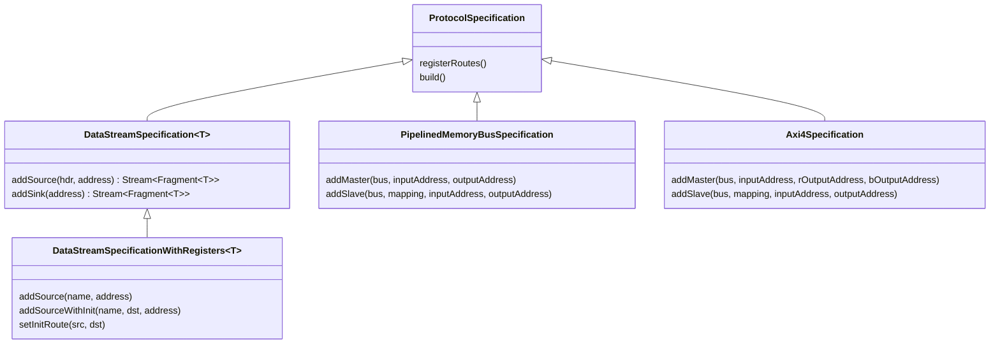

- **`ProtocolSpecification`** is the shared contract: it registers itself
  with the builder on construction, and exposes two hooks the builder calls
  at fixed points — `registerRoutes()` (declare which `(input, output)` slot
  pairs must actually be routable, *before* any address is auto-assigned) and
  `build()` (wire the real adapters, once every address is resolved).
- **`DataStreamSpecification[T]`** is the generic case: `addSource(hdr,
  address)` takes a caller-supplied header `Bits` (the caller fully owns
  routing/subheader encoding) and returns a driveable `Stream[Fragment[T]]`;
  `addSink(address)` returns a readable stream with the routing header flit
  already stripped off by the fabric. Defaults to full source×sink
  connectivity. `DataStreamSpecificationWithRegisters` layers a `BusIf` CSR
  (`<name>_hdr`) per source so firmware can retarget a source's destination
  at runtime, an optional compile-time default destination
  (`addSourceWithInit`/`setInitRoute`), and a device-tree fragment describing
  every sink's name and address.
- **`PipelinedMemoryBusSpecification`** exposes a PMB master/slave fabric:
  `PipelinedMemoryNocMaster`/`PipelinedMemoryNocSlave` gateways packetize one
  PMB transaction as one NoC packet (a `Header` flit, then one payload flit).
  Because `PipelinedMemoryBusRsp` is an untagged `Flow` with no
  per-transaction tag, each master gateway allows only **one outstanding
  read at a time** (`haltWhen`), and the slave gateway keeps a receive-order
  `PendingRsp` FIFO to route each response back to the master that asked for
  it.
- **`Axi4Specification`** is the AXI4 analogue, over `Axi4Shared` (merged
  address+data `arw` channel, so one transaction is still one packet per
  direction). Unlike PMB, AXI4's `id` field lets many transactions stay
  outstanding at once — no single-outstanding-read restriction — the only
  requirement is the usual AXI4 rule (never reuse an `id` while it's still
  outstanding, checked by an `assert` in `Axi4NocSlave`). A master needs
  *two* independent delivery addresses (`rOutput` for read data, `bOutput`
  for write acknowledgements), since a slave can't multiplex both response
  kinds onto one stream.

Every adapter's master/slave (or source/sink) needs **two independent node
addresses** — an *input* slot (where it injects packets) and an *output*
slot (where the fabric delivers packets addressed to it) — since a producer
and consumer role need not sit at the same physical node. `NoCBuilder`
tracks and auto-assigns these two address spaces independently (see
[Building a NoC](#building-a-noc)).

## Component relationships

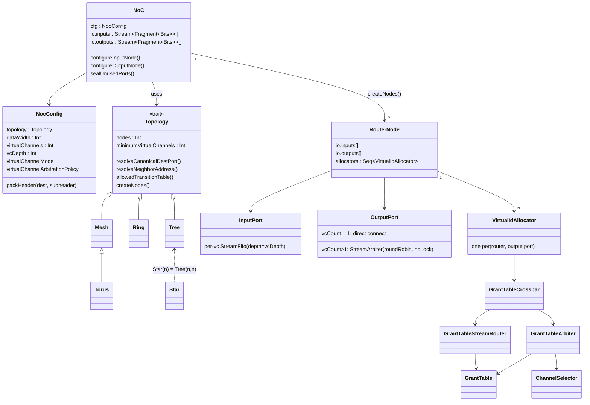

`GrantTableCrossbar`/`GrantTableArbiter`/`GrantTableStreamRouter`/
`GrantTable`/`ChannelSelector` live in `spinalextras.lib.misc.arbitration` —
they know nothing about flits, headers, or topologies, and are exercised by
their own formal test suites independently of the NoC.

## Building a NoC

```mermaid
flowchart LR
  classDef step fill:#e8eef7,stroke:#4b6fa8,color:#1c2b40
  A["new NoCBuilder(cfg)"]:::step --> B["one or more ProtocolSpecifications<br/>share the builder<br/>(DataStreamSpecification, PipelinedMemoryBusSpecification, Axi4Specification, ...)"]:::step
  B --> C["builder.build()"]:::step
  C --> D["every spec's registerRoutes()<br/>(declares required input→output slot pairs)"]:::step
  D --> E["output slots resolved first,<br/>then input slots<br/>(steered away from required partners' addresses)"]:::step
  E --> F["every spec's build()<br/>(wires adapters using resolved addresses)"]:::step
  F --> G["new NoC(cfg); wire every<br/>registered input/output; sealUnusedPorts()"]:::step
  G --> H["fully-wired NoC component"]:::step
```

## NoCBuilder usage

A `NoCBuilder` wraps one `NocConfig`/`Topology` and lets any number of
[protocol adapters](#protocol-adapters) share it, each claiming its own input
and/or output node slot(s). A minimal single-adapter fabric
(`DataStreamSpecificationTest.scala`'s harness, trimmed):

```scala
val nocCfg = NocConfig(topology = new Mesh(2, 2), dataWidth = 32)
val builder = new NoCBuilder(nocCfg)

// Every ProtocolSpecification subclass takes the shared builder as a constructor arg,
// and registers its own routes/slots with it as soon as it's constructed.
val spec = new DataStreamSpecification(HardType(Bits(32 bits)), builder)

// addSource/addSink each claim one NodeSlot; pass an explicit address to pin it,
// or omit it (default -1) to let NoCBuilder auto-assign the lowest free node.
val src  = spec.addSource(headerBits)   // auto-addressed input slot
val sink = spec.addSink()               // auto-addressed output slot

// builder.build() resolves every auto-assigned slot, calls each spec's build() to wire
// its adapters, then constructs and fully wires the underlying NoC.
val noc = builder.build()
```

Multiple adapters can share one builder — and therefore one physical
fabric — as long as the topology has enough nodes for every slot they
collectively claim; each adapter only needs to know about `builder`, not
about any other adapter sharing it. `Axi4SpecificationTest.scala`'s harness
shows this for a single master/slave pair:

```scala
val builder = new NoCBuilder(nocCfg)
val spec = new Axi4Specification(axiConfig, builder)

// AXI4 needs two independent output addresses per master (see Protocol adapters):
// one for read data, one for write acknowledgements.
spec.addMaster(masterBus, masterInputAddress, masterROutputAddress, masterBOutputAddress)
spec.addSlave(slaveBus, SizeMapping(0, BigInt(1) << axiConfig.addressWidth),
              slaveInputAddress, slaveOutputAddress)

val noc = builder.build()
```

`PipelinedMemoryBusSpecification` follows the same `addMaster`/`addSlave`
shape (one output address per master, since PMB responses carry no
per-transaction tag — see [Protocol adapters](#protocol-adapters)):

```scala
val builder = new NoCBuilder(nocCfg)
val spec = new PipelinedMemoryBusSpecification(pmbConfig, builder)

spec.addMaster(masterBus, masterInputAddress, masterOutputAddress)
spec.addSlave(slaveBus, SizeMapping(0, BigInt(1) << pmbConfig.addressWidth),
              slaveInputAddress, slaveOutputAddress)

val noc = builder.build()
```

A slot's resolved address (`NodeSlot.resolvedAddress`) is only legal to read
**after** `builder.build()` returns — auto-assignment happens inside it, once
every specification sharing the builder has had a chance to register its
claims. `DataStreamSpecificationHarness` needs a resolved sink address to
bake into a source's header, so it defers that until after `build()`:

```scala
val noc = builder.build()

val destSlot = spec.sinkSlot(sinkStream).get
val destRouteable = nocCfg.topology.addressToRouteableAddress(destSlot.resolvedAddress)
headerBits := nocCfg.packHeader(U(destRouteable, nocCfg.topology.addressSize bits),
                                 U(0, nocCfg.topology.addressSize bits))
```

## Gate count / resource usage

`NocGateCount` (`lib/noc/NocGateCount.scala`) elaborates a `NoC` for a given
`NocConfig` to Verilog and runs it through yosys (`read_verilog` →
`hierarchy -top` → `proc` → `flatten` → `opt -full` → `stat`), parsing the
resulting cell/wire/memory counts. This deliberately stops at a generic
`opt` pass rather than a full technology-mapped `synth`, so the numbers below
are a rough, *relative* size comparison across configurations — not real
ASIC/FPGA gate counts. `NocGateCount.report()` prints a plain
sorted-by-cell-count summary for `NocConfig.testConfigurations()` (or any
configuration list); `NocGateCountMarkdownApp.main` runs the same thing over
a fixed set of representative configurations and renders it as the Markdown
table below (optionally writing it to a file path given as the first CLI
argument) — this is how [`profile.md`](profile.md)'s table is produced and
can be regenerated.

| Topology | Nodes | Data Width | VCs | VC Depth | VC Mode | VC Policy | wire bits | memories | memory bits | cells |
|---|---|---|---|---|---|---|---|---|---|---|
| Ring | 4 | 64 | 2 | 2 | Static | LowestFirst | 83.33 kb | 20 | 2.60 kb | 2097 |
| Mesh (2,2) | 4 | 64 | 1 | 2 | Static | LowestFirst | 47.04 kb | 12 | 1.56 kb | 996 |
| Mesh (4,4) | 16 | 16 | 1 | 2 | Static | LowestFirst | 89.00 kb | 64 | 2.18 kb | 6824 |
| Mesh (4,4) | 16 | 64 | 1 | 2 | Static | LowestFirst | 284.84 kb | 64 | 8.32 kb | 6824 |
| Mesh (4,4) | 16 | 16 | 1 | 2 | Static | RoundRobin | 90.79 kb | 64 | 2.18 kb | 8152 |
| Ring | 16 | 16 | 2 | 2 | Static | LowestFirst | 106.95 kb | 80 | 2.72 kb | 8601 |
| Mesh (4,4) | 16 | 16 | 2 | 2 | Static | LowestFirst | 166.72 kb | 116 | 3.94 kb | 14120 |
| Torus (4,4) | 16 | 16 | 2 | 2 | Static | LowestFirst | 237.90 kb | 160 | 5.41 kb | 22120 |
| Mesh (4,4) | 16 | 16 | 2 | 2 | Static | LowestFirst | 166.72 kb | 116 | 3.94 kb | 14120 |
| Mesh (4,4) | 16 | 16 | 4 | 2 | Static | LowestFirst | 312.79 kb | 264 | 10.91 kb | 26240 |
| Mesh (4,4) | 16 | 16 | 4 | 2 | Dynamic | LowestFirst | 381.73 kb | 264 | 10.91 kb | 52760 |

## Test harnesses

- `lib/tests/noc/NoCPathing.scala` — single-packet delivery correctness
  across every entry in `NocConfig.testConfigurations()` (all five
  topologies × VC count × VC mode × arbitration policy, filtered by each
  topology's `minimumVirtualChannels`).
- `lib/tests/noc/NoCConcurrence.scala`:
  - `NocConcurrencySpec` forks one sender per source node and floods
    `packetsPerSrc = 4 * virtualChannels * vcDepth` packets per topology —
    deliberately far more than the network's total per-link buffering, since
    (per [Deadlock avoidance](#deadlock-avoidance-escape-vc-datelines)) a
    cyclic dependency is a permanent deadlock, not something a light load
    would happen to avoid by luck. Reconstructs packets per `(node, vc)` on
    receive and asserts both correctness and genuine overlap-in-flight
    (`overlapExists`), i.e. that VC isolation actually lets multiple packets
    make progress concurrently rather than merely not corrupting each other.
  - `RingOneWayRegressionSpec` — fixed regression for the
    `OutputPort`-starvation deadlock described in
    [Deadlock avoidance](#deadlock-avoidance-escape-vc-datelines), reproduced
    under `Ring(3, ClockwiseAlways)` traffic.
  - `NocVCIDSpec`'s `manyToOne` scenario deliberately contends multiple
    senders on one destination's inbound link across distinct VCs, to stress
    VC isolation under real contention.
- `NocDebug.dumpStalledState(noc)` — a simulation-only helper, callable from
  a testbench right before a timeout assertion fires, that prints exactly
  which `(node, output port, vc lane)` resources are currently held, by which
  candidate, and which candidates are still requesting but blocked — enough
  to find a genuine cyclic buffer dependency without baking `report()` calls
  into the RTL and recompiling.
- `lib/tests/noc/DataStreamSpecificationTest.scala`,
  `PipelinedMemoryBusSpecificationTest.scala`, `Axi4SpecificationTest.scala`
  — end-to-end tests of the `NoCBuilder` + `ProtocolSpecification` path for
  each protocol adapter.
- Structural invariants below the NoC-specific tests are covered by formal
  (SymbiYosys) test suites scattered through the source —
  `ChannelSelectorFormalTester`, `GrantTableFormalTester`,
  `GrantTableCrossbarFormalTester`, `GrantTableStreamRouterFormalTester`,
  `VirtualIdAllocatorFormalTester`, `InputPortFormalTester`,
  `VCStaticMapFormalTester`/`VCDynamicMapFormalTester`,
  `NocRouterFormalTester`, `NocFormalTester` — proving properties like grant
  mutual-exclusion and a valid `vc` field range. These are per-component
  invariants, not a system-wide deadlock-freedom proof; deadlock avoidance at
  the whole-network level is validated by the heavy-load simulation scenarios
  above, not a formal property.
